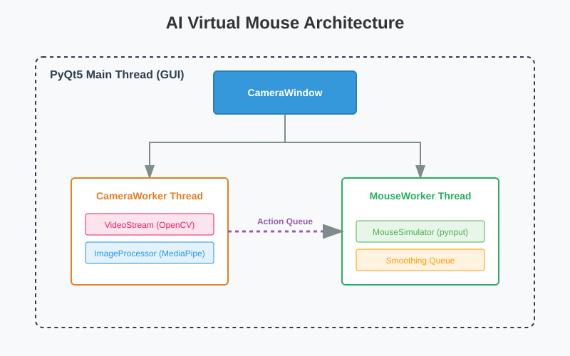

# 📱 AI 虚拟鼠标 - 项目总结

## 🎯 项目概述

**AI 虚拟鼠标** 是一个基于手势识别的鼠标控制应用，使用 Google MediaPipe 实现实时的手部关键点检测，让用户可以通过手势来控制计算机鼠标。

### 核心特性

- ✨ **实时手势检测** - 每帧识别手部关键点
- 🖱️ **手势控制** - 食指移动鼠标，食指+中指点击
- ⚡ **高性能** - 经过优化的多线程架构
- 🎮 **跨平台支持** - Windows、Linux、macOS
- 🚀 **GPU 加速** - Linux/macOS 自动启用（如果可用）

---

## 🏗️ 系统架构



### 核心模块

| 模块 | 功能描述 |
|------|--------|
| **VideoStream** | 摄像头数据采集与处理 |
| **ImageProcessor** | MediaPipe 手势识别、坐标转换 |
| **CameraWorker** | 多线程视频处理工作线程 |
| **MouseWorker** | 鼠标操作队列处理线程 |
| **ROIManager** | 感兴趣区域（ROI）管理，支持边界自适应 |
| **DrawUtils** | UI 渲染管线（关键点、FPS、ROI 边界）|
| **MouseSimulator** | 鼠标移动和点击封装 |

---

## 🔧 技术栈

### 核心依赖
- **MediaPipe 0.10.14** - 手部关键点识别（Google）
- **PyQt5 5.15+** - GUI 框架
- **OpenCV 4.8+** - 图像处理
- **pynput 1.7+** - 跨平台鼠标控制
- **NumPy 1.24+** - 数值计算

### 平台支持

| 平台 | GPU 加速 | 状态 |
|------|---------|------|
| Windows | ❌ (CPU only) | ✅ 完全支持 |
| Linux | ✅ (需要兼容 GPU) | ✅ 完全支持 |
| macOS | ✅ (Metal) | ✅ 完全支持 |

---

## 🖐️ 使用方式

### 手势控制映射

```
食指位置 ──────▶ 鼠标坐标
           (实时映射)

食指 + 中指        鼠标左键
靠近（距离<0.05）──▶ 按住/释放
```

### ROI 机制

- **感兴趣区域（ROI）**：映射摄像头画面的中心 80% 到屏幕
- **优势**：避免边缘手指识别问题，提高精准度
- **配置**：可通过 `ROIManager(scale=0.8)` 调整

---

## ⚙️ 性能优化

### 关键优化策略

1. **关键帧提取** - 每 3 帧进行一次完整识别
2. **异步队列** - 分离 GPU 识别和 CPU 鼠标操作
3. **轨迹平滑** - 加权平均最近 5 个坐标点
4. **阈值过滤** - 移动距离小于阈值时不发送队列
5. **原生 API** - 使用 pynput 替代 pyautogui 提升速度

### 预期性能
- **帧率**: 15-30 FPS（CPU）/ 25-60 FPS（GPU）
- **延迟**: < 100ms
- **鼠标精度**: 屏幕 80% 区域完全覆盖

---

## 🚀 快速开始

### 环境要求
- Python 3.12（MediaPipe 限制）
- USB 摄像头
- Windows 平台建议

### 安装

```bash
# 克隆仓库
git clone https://github.com/ForgotDream/hand_detection.git
cd hand_detection

# 方式 1：使用 uv（推荐）
uv sync
uv run main.py

# 方式 2：使用 pip
python -m venv .venv
.venv\Scripts\activate  # Windows
pip install -e .
python main.py
```

### 特殊配置

**Linux (Wayland 桌面)**
```bash
export QT_QPA_PLATFORM=wayland
python main.py
```

**Linux (USB 摄像头在 WSL)**
- 确保用户在 `video` 组：`sudo usermod -aG video $USER`
- 或使用 [usbipd-win](https://github.com/dorssel/usbipd-win) 共享设备

---

## 📋 开发历程回顾

| 日期 | 主要工作 | 成果 |
|------|--------|------|
| 12.13 | GUI 框架搭建、手势识别集成 | 基础功能完成 |
| 12.14 | 鼠标操作实现、跨平台适配 | 核心功能就绪 |
| 12.15 | ROI 管理、性能优化、渲染管线 | 功能完善 |

### 关键问题排查

| 问题 | 原因 | 解决方案 |
|------|------|--------|
| MediaPipe 导入失败 | 版本过新（0.10.15+） | 降级至 0.10.14 |
| macOS 图像异常 | Metal 不支持 RGB 格式 | 转换为 RGBA 格式 |
| 鼠标操作缓慢 | pyautogui 实现低效 | 切换至 pynput |
| 边缘手指难控制 | 摄像头边界误识别 | 引入 ROI 机制 |

---

## 📚 相关资源

- [MediaPipe 官方文档](https://developers.google.com/mediapipe)
- [PyQt5 教程](https://doc.qt.io/qt-5/index.html)
- [项目 README](README.md)
- [开发日志](DEVBLOG.md)

---

## 📝 总结

这个项目展示了现代化的 Python GUI 应用开发，结合了深度学习推理、多线程编程和实时图像处理。通过充分利用 MediaPipe 这样的高质量开源库，加上细致的性能优化和架构设计，成功实现了一个流畅、实用的手势控制系统。

**关键成就**：
- ✅ 全面的手部识别功能
- ✅ 跨平台兼容性
- ✅ 直观的用户交互
- ✅ 优化的实时性能
- ✅ 清晰的代码架构

---

*最后更新: 2026年1月6日*
